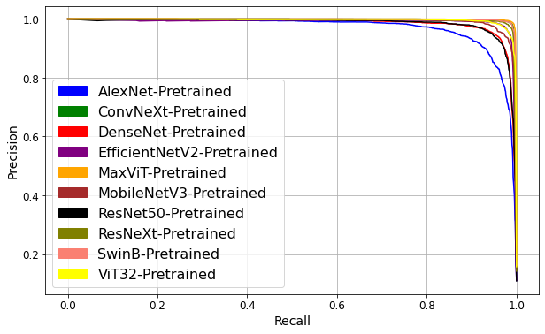

# Land Cover Image Classification with EuroSAT


## Introduction

This repository contains the code for land cover image classification using deep learning models. The goal of this project is to provide accurate and efficient classification of land cover types, leveraging state-of-the-art deep learning techniques. The models are trained and evaluated on the EuroSat dataset, a patch-based LC classification dataset based on Sentinel-2 satellite images.

## Features

- Implementation of various deep learning models for land cover image classification
- Preprocessing and data augmentation techniques for effective model training
- Evaluation of models with pre-trained weights and training from scratch
- Comparative analysis of different deep learning architectures
- Visualization of results and performance metrics

## Models

The following deep learning models are implemented in this project:

- Convolutional Neural Networks (CNNs):
  - AlexNet
  - ResNet50
  - ResNeXt
  - DenseNet
  - MobileNetV3
  - EfficientNetV2
  - ConvNeXt
  
- Transformer-Based Models:
  - Vision Transformer (ViT)
  - Swin Transformer
  - MaxViT

## Dataset

The [EuroSat dataset](# Land Cover Image Classification with EuroSAT


## Introduction

This repository contains the code for land cover image classification using deep learning models. The goal of this project is to provide accurate and efficient classification of land cover types, leveraging state-of-the-art deep learning techniques. The models are trained and evaluated on the EuroSat dataset, a patch-based LC classification dataset based on Sentinel-2 satellite images.

## Features

- Implementation of various deep learning models for land cover image classification
- Preprocessing and data augmentation techniques for effective model training
- Evaluation of models with pre-trained weights and training from scratch
- Comparative analysis of different deep learning architectures
- Visualization of results and performance metrics

## Models

The following deep learning models are implemented in this project:

- Convolutional Neural Networks (CNNs):
  - AlexNet
  - ResNet50
  - ResNeXt
  - DenseNet
  - MobileNetV3
  - EfficientNetV2
  - ConvNeXt
  
- Transformer-Based Models:
  - Vision Transformer (ViT)
  - Swin Transformer
  - MaxViT

## Dataset

The [EuroSat dataset](https://github.com/phelber/EuroSAT) is used for training and evaluation. It is a patch-based LC classification dataset based on Sentinel-2 satellite images. The dataset contains labeled images from various land cover types in 34 European countries. Information about data splits, classes, and other details can be found in the dataset documentation.


## Results

Classification accuracy comparison on ten deep learning models. The *Accuracy* column shows the results of the models trained from scratch, while the *Accuracy pre-trained* column shows the results of retraining with pre-trained weights. The first seven are convolutional-based models, while the last three are Transformer-based models.


Precision/recall curves for the ten models. The curves show that the models trained from scratch present more variability in their results, with ConvNeXt on the lower and MaxViT on the higher end. 


For the pre-trained models, the curves are closer to each other, with AlexNet as the lowest-performance model and MaxViT on the higher end. Curiously, ConvNeXt was the lowest-performance model trained from scratch but was on par with the best models when trained with pre-trained weights. This may indicate that the transfer learning used with the pre-trained weights helps alleviate the relatively small size of this dataset for such a model.




## Requirements

To run the code in this repository, we used the following:

- Python 3.11
- PyTorch 1.13
- Torchvision 0.14.1
- Other required libraries (e.g., NumPy, Pandas, Matplotlib) - specify versions if necessary

## Usage

1. Clone this repository:

   ```shell
   git clone https://github.com/jrterven/eurosat_classification.git
   cd eurosat_classification
   ```

2. Install the required dependencies: 


3. Prepare the EuroSat dataset:

   - Download the [EuroSat dataset](https://github.com/phelber/EuroSAT)
   - Extract the dataset and place it in the appropriate directory (e.g., `data/`) 

4. Train and evaluate the models:  
We provide Jupyter notebooks for training each model.


## License

This project is licensed under the [MIT License](LICENSE).

## Acknowledgments

- We thank the following [Kaggle contribution](https://www.kaggle.com/code/raufie/eurosat-classification) to serve as starting point for our code.

## Contact

For any questions or inquiries, please contact jrtervens@ipn.mx
